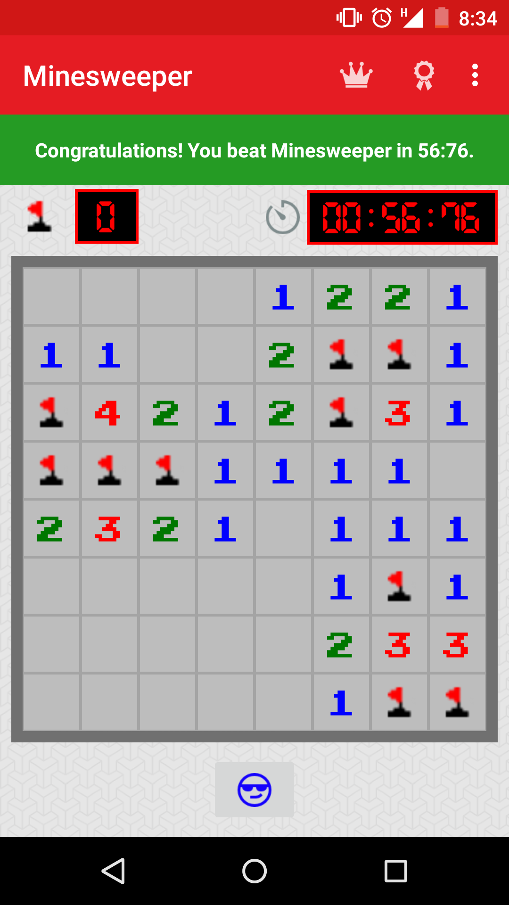

Minesweeper
===========

Classic Minesweeper Game

Race the world in uncovering all tiles that don't contain a mine.

The goal is to uncover all tiles that are not containing mines. Use 
the flags to help you mark where you think a mine might be located

I have included a timer in the top right corner to track how long the game has been running.  The counter at the top left is the number of green flags left.  These green flags can be used to mark where a mine might be.  To use flags instead of uncovering tiles, click the bottom left toggle button.  This toggle button is user to enable or disable flag mode.  When clicking on a tile, one of three things happens :
  
- Uncover a mine (which means game over) and all other mines are uncovered.  If a tile has been marked with a flag and it contains a mine, the flag will turn red.
- A number greater than 0 shows up, indicating the number of adjacent tiles that contain mines
- 0 shows up, which will subsequently uncover all adjacent tiles

The 8x8 grid which contains 64 tiles, 10 with mines, 54 without.  If 54 tiles are uncovered without uncovering a mine, then you win!

The button centered below the grid changes faces depending on a loss or a win.  To restart the game just click on this button.

Notes
=====

I integrated this app with the Google Play Games service.  You can check the Leaderboards as well as any Achievements that were unlocked.
If you beat the game, your score will be submitted to Google Play Games.

Future Todos
============
In the future, I would like to come up with different difficulty levels, different board sizes, saving game progress, more achievements to unlock.

Issues
======
Connecting to Google Play Services has issues on some devices.  I need to do some more exhaustive testing on mulitple devices.